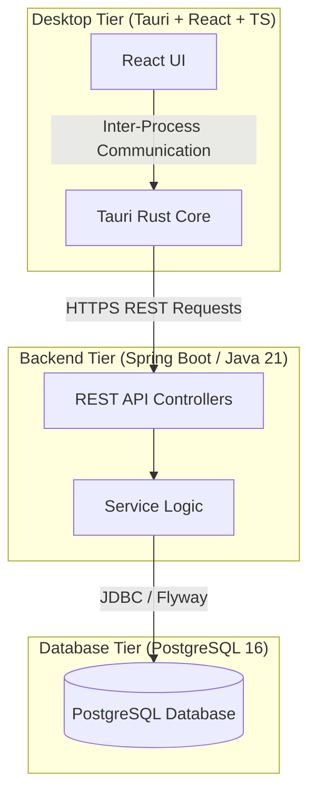

# System Architecture

This document describes the high-level architecture, subsystem boundaries, and structural patterns of **CRA MiniDesk**.

---

## 🏛️ High-Level Architecture

CRA MiniDesk follows a decoupled, three-tier client-server desktop architecture:

---

## 💻 Desktop App Responsibilities

The `desktop/` application is the primary entry point for technicians and service coordinators.
*   **User Interface**: Renders responsive screens using React and TypeScript.
*   **Local System Integration**: Leverages Tauri's Rust-based host layer to interface with macOS features (native file dialogs, system notifications, local PDF viewing/printing).
*   **Security & Networking**: Interacts securely with the backend API. It handles token storage securely inside OS-level credential stores (keychain integration via Tauri plugins) and routes requests through HTTPS.
*   **Performance**: Renders WebViews using native macOS WebKit instances, maintaining a extremely small RAM footprint (typically <100MB).

---

## ⚙️ Backend Responsibilities

The `backend/` application acts as the single source of truth for business logic and data persistence.
*   **REST API Layer**: Exposes stateless endpoints for client operations. Does not maintain HTTP sessions (JWT-based).
*   **Business Logic**: Governs domain workflows (repair transitions, billing calculations, inventory levels).
*   **Transactions & Concurrency**: Manages transactional boundaries using Spring Framework declarative transactions.
*   **Data Validation**: Enforces strict payload formatting and validation (e.g., JSR 380 standard validators) before data hits the storage engines.
*   **Audit Logging**: Documents critical actions (e.g., status changes, billing finalizations) securely to console/logs.

---

## 🗄️ PostgreSQL Database Responsibilities

The relational database layer ensures acid-compliant transactions and data integrity.
*   **Schema & Migrations**: Managed explicitly via Flyway migrations.
*   **Foreign Key Integrity**: Enforces structural constraints to prevent orphaned repair items or invalid customer entries.
*   **Performance Optimization**: Utilizes B-Tree indexes on highly searched fields (e.g., customer email, device serial, repair ticket status).

---

## ⏳ Repair Order Timeline

The platform records an append-only, immutable history of significant lifecycle events for each repair order:
*   **Transaction Boundaries**: Timeline events are recorded in the exact same database transaction as the repair order mutations. If the primary update fails or rolls back, the timeline event rolls back automatically.
*   **Write Access**: Clients have read-only access. Direct creation, mutation, or deletion of timeline entries via REST is prohibited.
*   **Audit Scope**: Currently records order creation (`REPAIR_ORDER_CREATED`), details updates (`REPAIR_DETAILS_UPDATED` with changed field lists), and transitions (`STATUS_CHANGED`). This acts as an internal state change history rather than a compliance audit log, as it does not yet attribute actions to system users.

---

## 🔮 Future Modules

To ensure portfolio-grade scalability, the architecture is designed to accommodate the following future enhancements:
1.  **Notification Hub**: Push notifications, SMS status updates, and email invoice delivery.
2.  **Part Stock Prediction**: Basic machine learning or statistical forecasting to prompt technicians when inventory drops below historical thresholds.
3.  **Client Portal**: A light web-based client portal using the same backend APIs for customers to track their device's live repair status.
