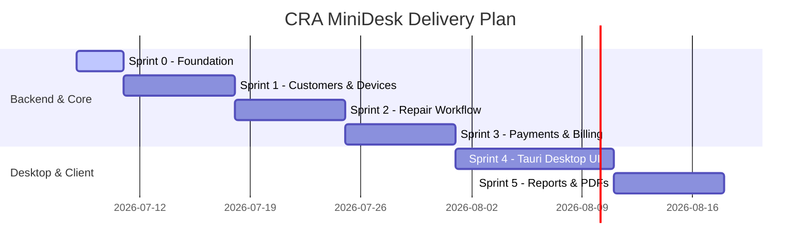

# Product Roadmap

This roadmap outlines the milestones and delivery schedule for **CRA MiniDesk**. Each sprint focuses on building solid, testable features.

---

## 📅 Milestones

---

## 🏃 Sprint Breakdown

### 🏁 Sprint 0: Product Foundation (Current)
*   **Deliverables**: Project file layout, Docker Compose setup, comprehensive development/architecture/security guides.
*   **Verification**: Healthy database container loop and verified `.gitignore` rules.

### 👥 Sprint 1: Customer & Device Management
*   **Deliverables**: Scaffolding Spring Boot backend, flyway table scripts for `customers` and `devices`.
*   **Key APIs**: CRUD operations for Customers (name, phone, history) and Devices (serial number, type, specs).

### 🛠️ Sprint 2: Repair Order Workflow
*   **Deliverables**: Core business workflow engine, database schema updates for `repair_orders`.
*   **Key APIs**: Create repair ticket, status updates (Pending -> Diagnostics -> In Progress -> Ready for Pickup), assignment of technicians to orders.

### 💳 Sprint 3: Payments & Delivery
*   **Deliverables**: Billing modules, database schemas for `invoices` and `payments`.
*   **Key APIs**: Pricing calculations, adding items/parts used from inventory, closing out tickets upon successful payment.

### 🖥️ Sprint 4: Desktop UI
*   **Deliverables**: Scaffolding React + Vite + Tauri, designing main layout (sidebar, grid layouts, glassmorphism design elements).
*   **UI Features**: Dashboard containing active repairs, searchable customer list, new repair input form.

### 📊 Sprint 5: Reports & PDF Service Forms
*   **Deliverables**: Dynamic PDF receipt generation engine on the backend, data exporting (CSV/Excel reports).
*   **UI Features**: Button to generate and view receipt, reports dashboard showing weekly revenue and completed tasks.
